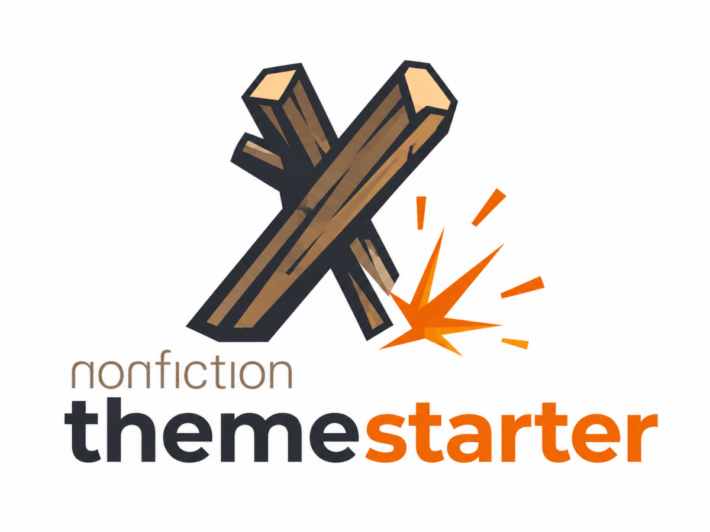

# nonfiction theme-starter



A starter kit for nonfiction WordPress themes: [`nf`](https://github.com/nonfiction/nf) at the command line, [nonfiction/theme](https://github.com/nonfiction/theme) in PHP, Timber and Twig for rendering, Composer for PHP packages, and Vite for front-end assets.

This repository is meant to be copied at the start of a client project. It gives you a working local WordPress environment, a small block library, starter content, predictable formatting, and a theme structure that stays pleasant as the site grows.

The main idea is simple: use `nf` from the repository root. Raw Docker, Composer, npm, and WP-CLI commands are still available when you need them, but `nf` is the friendly front door.

## Start Here

Enter the development shell:

```sh
nix develop
```

Refresh PHP and JavaScript dependencies:

```sh
nf theme composer
nf theme npm
```

Start WordPress:

```sh
nf env up
```

Seed the starter site:

```sh
nf theme seed
```

Show the local URLs, ports, paths, and environment metadata:

```sh
nf env show
```

Watch theme assets while you work:

```sh
nf theme watch
```

That is the happy path. After those commands, you should have a local WordPress site running this theme, sample pages in the menu, and built assets rebuilding as you edit files.

## What You Get

This starter is intentionally small, but it is not empty. It includes enough shape to begin real work without forcing every project into the same final design.

- A Composer-managed WordPress theme in `theme/`
- Timber 2 and Twig templates for page rendering
- The shared `nonfiction/theme` app layer for imports, assets, post helpers, menus, blocks, and view resolution
- Vite entry points for head assets, body assets, block editor assets, editor UI assets, and admin assets
- A compact custom block set for banners, callouts, grids, cards, and accordions
- An example `article` custom post type with archive, single, and block wiring
- A seed script that creates useful QA content instead of a blank install
- Nix, treefmt, PHP-CS-Fixer, Prettier, ESLint, PHPactor, Composer, Node, and Docker client tooling in one dev shell

The result is a starter that teaches the project architecture while giving you useful seams to cut, rename, and extend.

## A First Tour

Most project work happens in `theme/app`.

```text
theme/functions.php        Theme bootstrap, imports, Timber context, Twig extensions
theme/app/                 Views, custom post types, custom blocks, and app assets
theme/app/views/           Global Twig templates and native post/page helpers
theme/app/blocks/          Reusable custom blocks
theme/app/<cpt>/           Custom post type modules, views, blocks, scripts, styles
theme/config/              WordPress configuration hooks and admin tweaks
theme/src/                 Project-local PHP classes loaded by Composer
theme/dist/                Built Vite assets
theme/vendor/              Composer dependencies
```

`theme/functions.php` is the bootstrap. It initializes `Nonfiction\Theme\App`, imports modules, registers view paths, enqueues the Vite manifest, registers menus, adds theme support, and fills the global Timber context.

The import rules are deliberately predictable:

```php
App::import([
  'app/views/*.php',
  'app/*/index.php',
  'app/blocks/*/index.php',
  'app/*/blocks/*/index.php',
  'config/*.php',
]);
```

Those paths give the starter its rhythm:

- Put reusable blocks in `theme/app/blocks/<block>/`.
- Put custom post types in `theme/app/<cpt>/index.php`.
- Put custom post type views in `theme/app/<cpt>/views/`.
- Put custom post type-specific blocks in `theme/app/<cpt>/blocks/<block>/`.
- Put native WordPress post and page helpers in `theme/app/views/`, not in `theme/app/post/` or `theme/app/page/`.
- Put shared layouts, partials, and broad Twig templates in `theme/app/views/`.
- Put project-local PHP classes in `theme/src/` only when they are real reusable PHP extensions.

When in doubt, colocate the files that change together. A block can own its `block.json`, PHP registration, editor JavaScript, frontend script, styles, and view markup. A custom post type can own its registration, templates, blocks, scripts, and styles.

## The Local Site

`nf env up` starts the Docker-backed local WordPress environment defined by `nf` and `nf.json`.

Useful environment commands:

```sh
nf env up
nf env down
nf env reset
nf env show
nf env logs
nf env shell
nf env wp -- <args>
```

Use WP-CLI through `nf env wp --`:

```sh
nf env wp -- theme list
nf env wp -- plugin list
nf env wp -- post-type list
```

Configured plugins live in `nf.json` under `wordpress.plugins`. The list is bootstrap intent: it tells new environments which plugins this project expects, but it is not a full plugin lifecycle policy.

Plugin helpers:

```sh
nf env plugins list
nf env plugins status
nf env plugins diff
nf env plugins install --dry-run
nf env plugins install --yes
```

Snapshot helpers:

```sh
nf env snapshot list
nf env snapshot add before-big-change
nf env snapshot use before-big-change --yes
nf env snapshot prune --dry-run
```

## Starter Content

Run the seed task after a fresh environment:

```sh
nf theme seed
```

The seed script is safe to run again. It looks for existing content before creating new content.

It does the useful setup work people otherwise forget:

- Sets permalinks to `/%postname%/`
- Removes Hello Dolly if it is installed
- Creates Home, About, Services, Contact, Resources, and child resource pages
- Creates a Block Examples page with the starter blocks already placed
- Creates and assigns a `Primary` menu to the `primary` theme location
- Sets Home as the static front page
- Creates a starter Article if the `article` custom post type is available
- Flushes rewrite rules

Good QA routes after seeding:

```text
/
/about/
/services/
/block-examples/
/resources/
/resources/resource-one/
/resources/resource-two/
/contact/
/articles/
/articles/starter-article/
/search/starter/
/not-a-real-page/
```

Use those pages as quick checks while changing navigation, templates, blocks, archives, search, and 404 behavior.

## Working With Twig

Twig templates live under the view paths registered in `theme/functions.php`:

```php
App::views([
  'app/views',
  'app',
]);
```

That means a template can be global, module-local, or block-local depending on where it belongs.

Examples:

```text
theme/app/views/base.twig
theme/app/views/page.twig
theme/app/views/partial/header.twig
theme/app/article/views/archive.twig
theme/app/article/views/single.twig
```

The global Timber context currently includes common values such as `site`, menus, image path helpers, the search query, current year, side navigation data, the current post, and current post collection.

Useful menus in context:

```twig
{{ menu_primary }}
{{ menu_utility }}
{{ menu_footer }}
{{ menu_social }}
```

Useful Twig helpers added by the theme:

```twig
{{ title|titleize }}
{{ label|humanize }}
{{ price|currency }}
{{ number|padded }}
{{ edit_post_link() }}
```

Keep presentation in Twig and pass real data from PHP. If a template starts doing business logic, move that logic into the post class, block registration, helper function, or module PHP file that owns it.

## Starter Blocks

Reusable starter blocks live in `theme/app/blocks/`.

Current generic blocks:

- `nf/banner`: a full-width page introduction with a background image, heading, and supporting text
- `nf/aside`: a callout block with a heading and nested content
- `nf/grid`: a responsive container for repeated content
- `nf/card`: a card intended for use inside `nf/grid`
- `nf/accordion`: a grouped set of expandable items
- `nf/accordion-item`: a single item inside `nf/accordion`

The article module also includes `nf/article-archive` under `theme/app/article/blocks/article-archive/`. That location is intentional: it belongs to the Article feature, not to every theme.

A typical block directory looks like this:

```text
theme/app/blocks/banner/
  block.json
  index.php
  index.js
  script.js
  style.css
```

Use `block.json` for metadata, `index.php` for registration and rendering setup, `index.js` for editor registration, `script.js` for frontend behavior, and `style.css` for styles. Keep the block self-contained unless it truly shares behavior with other blocks.

Before client work begins, decide which starter blocks are useful primitives and which ones are just examples. Delete what the project does not need. Move feature-specific blocks under `theme/app/<cpt>/blocks/`.

## Assets And Vite

Vite builds a WordPress-oriented manifest into `theme/dist/manifest.json`, and `App::enqueue('dist/manifest.json')` loads those assets from PHP.

Entry points live in `theme/vite.config.js`:

```js
const entryPoints = {
  head: "app/head.js",
  body: "app/body.js",
  blocks: "app/blocks.js",
  editor: "app/editor.js",
  admin: "config/admin.js",
};
```

Use the watch task while developing:

```sh
nf theme watch
```

Build assets once:

```sh
nf theme build
```

The Vite config supports JSX in theme app JavaScript and aliases `@nf` to `theme/app/nf.js`, which provides a small wrapper around WordPress block registration.

## Formatting And Checks

The Nix dev shell exposes the project tooling:

- `nf`
- `treefmt`
- PHP 8.3
- Composer
- PHP-CS-Fixer
- PHPStan
- PHPactor
- Node 24
- Docker client
- Git

Format configured files from the repository root:

```sh
treefmt
```

`nix fmt` uses the same treefmt wrapper.

Treefmt runs Alejandra for Nix, PHP-CS-Fixer for authored theme PHP, and Prettier for Markdown plus theme CSS, HTML, JavaScript, JSON, Twig, YAML, and YML files. The Prettier wrapper runs from `theme/` so it can use `theme/.prettierrc.json`, `theme/.prettierignore`, and the project-local Twig plugin.

If Prettier is missing, install or refresh theme node dependencies:

```sh
nf theme npm
```

Check PHP style without modifying files:

```sh
composer --working-dir=theme check:php-style
```

Run JavaScript linting:

```sh
npm --prefix theme run lint
```

Run an asset build:

```sh
nf theme build
```

The current `nf.json` keeps custom theme tasks intentionally lean: `build`, `composer`, `npm`, `seed`, `test`, and `watch`. Older wrapper tasks such as `format`, `lint`, and `release` are not currently configured. The `test` task still delegates to the removed `lint` wrapper, so use the direct Composer/npm checks above until that task is restored.

## nf Command Reference

`nf.json` is the project manifest. It records the project slug, WordPress theme path, theme slug, environment settings, configured plugins, artifact path, remotes, and custom theme tasks.

List the current theme tasks:

```sh
nf theme tasks
```

Current custom theme tasks:

```sh
nf theme build     # Build Vite assets
nf theme composer  # Update Composer dependencies and optimized autoload
nf theme npm       # Refresh npm development dependencies
nf theme seed      # Seed starter WordPress content
nf theme test      # Currently delegates to a removed lint wrapper
nf theme watch     # Watch Vite assets
```

Built-in theme commands:

```sh
nf theme tasks
nf theme package --dry-run
nf theme package
nf theme deploy <remote> --dry-run
nf theme deploy <remote>
nf theme rollback <remote> --dry-run
```

`nf theme package` zips the files that already exist. It does not run Composer, npm, or an asset build first. Build and check the project before packaging.

Environment commands:

```sh
nf env up
nf env down
nf env reset
nf env show
nf env logs
nf env shell
nf env wp -- <args>
nf env plugins list
nf env plugins status
nf env plugins install --dry-run
nf env snapshot list
```

Remote commands are configured per project. This starter ships with no remotes.

```sh
nf remote list
nf remote add production
nf theme deploy production --dry-run
```

Use `--dry-run` before any deploy or destructive sync. Treat remotes as project-specific infrastructure, not starter defaults.

## Starting A Client Theme

When you copy this starter for a client, make the project yours before adding features.

Update these values first:

- `nf.json` `project.slug`
- `nf.json` `wordpress.theme_slug`
- `nf.json` `artifact.path`
- `theme/style.css` `Theme Name`, `Text Domain`, `Description`, and `Version`
- `theme/package.json` `name`, `version`, and repository URL
- `theme/composer.json` `name` and `description`
- README title and project description
- Any block names, labels, namespaces, or example content that should become client-specific
- Any configured plugins in `nf.json` that do not belong in the project

The theme slug matters. `nf theme package` uses `wordpress.theme_slug` as the zip root directory even though source files live in `wordpress.theme_path`.

After renaming, run the first checks:

```sh
composer --working-dir=theme check:php-style
npm --prefix theme run lint
nf theme build
nf theme package --dry-run
```

Then start trimming. A good starter theme is useful because it is easy to delete from. Remove example blocks, views, plugins, post types, routes, and content that are not part of the client project.

## Packaging And Deployment

Before packaging, make sure dependencies are current, assets are built, and checks pass:

```sh
nf theme composer
nf theme npm
composer --working-dir=theme check:php-style
npm --prefix theme run lint
nf theme build
```

Preview the package:

```sh
nf theme package --dry-run
```

Create the package:

```sh
nf theme package
```

When a project has a remote configured, preview deployment first:

```sh
nf theme deploy production --dry-run
```

Deploy only after the dry run matches what you expect:

```sh
nf theme deploy production
```

## Philosophy

This starter is a path, not a cage. Follow the structure while it helps, then simplify it for the project in front of you.

Keep reusable framework behavior in `nonfiction/theme`. Keep project behavior in this theme. Keep templates readable. Keep blocks close to their assets. Keep custom post type features together. Keep the command surface boring enough that the next developer can trust it.

That is the whole trick: a theme starter should make the first day faster without making the hundredth day heavier.
