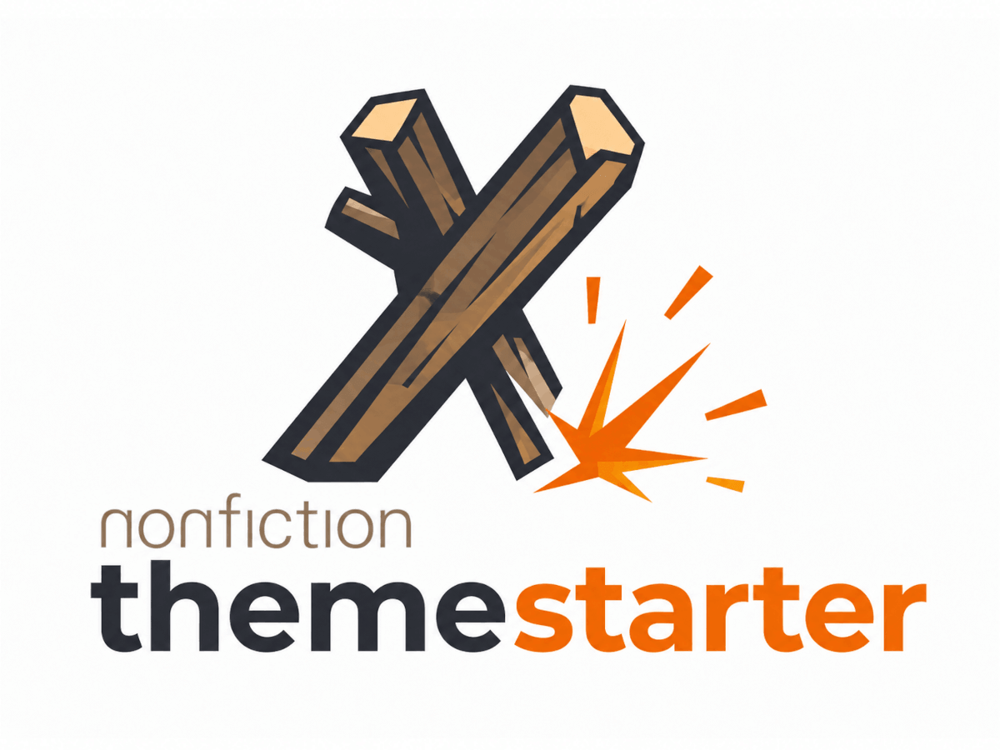

# nonfiction themestarter



A reusable starting point for nonfiction WordPress projects. It combines
[`nf`](https://github.com/nonfiction/nf),
[`nonfiction/theme`](https://github.com/nonfiction/theme), Timber, Twig,
Composer, and Vite without prescribing the final shape of every client site.

This is a template and validation project, not a client production site. Copy
it for greenfield work, rename the project and theme, then delete the examples
the new site does not need.

## Start Here

```sh
nix develop
nf theme update
nf env up
nf theme seed
nf env show
nf theme watch
```

The seed task creates starter pages, a Primary menu, example blocks, and an
Article so a fresh environment has useful QA routes.

## Project Shape

```text
nf.json                 WordPress checklist, tasks, package, defines, and remote
plugins/agency-credit/  Example repository-managed plugin
scripts/                Starter content and project utilities
theme/functions.php     Theme bootstrap
theme/app/              Views, modules, blocks, and asset entries
theme/app/views/        Shared Twig templates and native post/page helpers
theme/app/blocks/       Reusable custom blocks
theme/app/<feature>/    Colocated post type or feature code
theme/config/           WordPress hooks and admin assets
theme/src/              Reusable project-local PHP classes, when needed
```

`theme/functions.php` initializes `Nonfiction\Theme\App`, imports application
modules, registers Twig view paths, and enqueues the Vite manifest. Keep related
PHP, Twig, JavaScript, CSS, metadata, and images together when a feature owns
them.

The starter examples are intentionally disposable. Remove the Article module,
sample blocks, seed behavior, fallback themes, example define, or agency-credit
plugin when the client project does not need them.

## Starting A Client Project

1. Copy the repository without its Git history or local generated state.
2. Update `project.slug` in `nf.json`.
3. Update the first theme object's `slug`, `path`, and package output.
4. Rename the theme metadata in `theme/style.css` and relevant package files.
5. Replace starter branding, namespace, content, screenshots, and remote config.
6. Remove unused examples and add only evidenced plugins, defines, and aliases.
7. Run the checks, seed a fresh local site, and test the representative routes.

The manifest uses the current strict `nf.json` version 2 shape. Do not copy old
fields from historical starter documentation.

## Routine Commands

```sh
nf env up
nf env show
nf env wp -- <args>
nf plugin status
nf plugin diff
nf theme check
nf theme build
nf theme package --dry-run
```

`nf theme package` stages production Composer dependencies, but it does not run
the Vite build. Build first and inspect the resulting
`dist/themestarter-v{version}.zip` before using it.

## Encrypted Defines

Commit-safe values may live directly in `nf.json`. Secret values are encrypted
in committed `nf.age`; `nf.json` stores only opaque references.

```sh
nf define list
nf define status
nf define sync
```

The included `MY_SECRET` is an example. Replace or remove it in copied client
projects. Never put decrypted values in documentation, logs, or the manifest.

## Validation Environment

The configured `linode` alias points to
`themestarter.linode1:live`, currently served at
`https://themestarter.linode1.nonfiction.dev/`. It is a shared starter
validation/demo environment, not evidence of a client production release.

Theme deployment does not move database content, uploads, plugin settings,
aliases, licenses, or secrets. Confirm the target and take a current backup
before any approved remote write.
